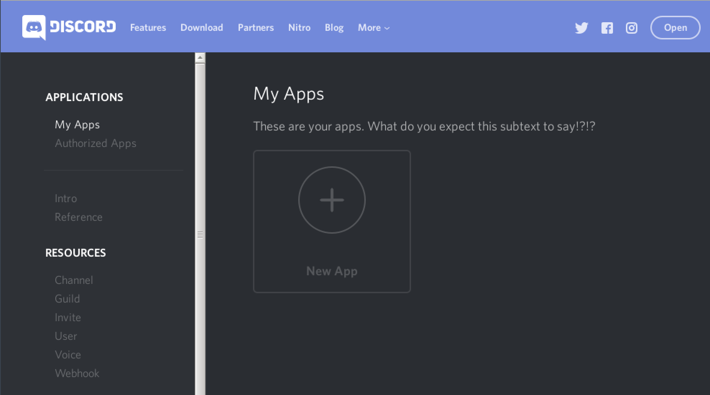
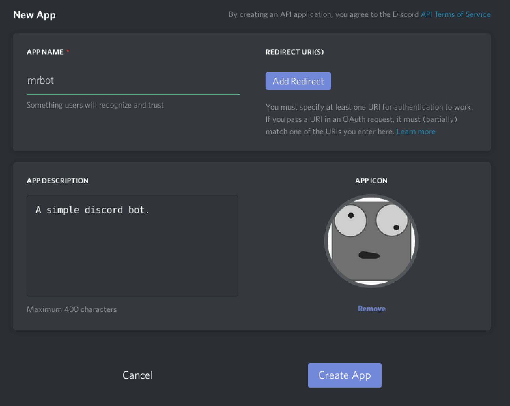
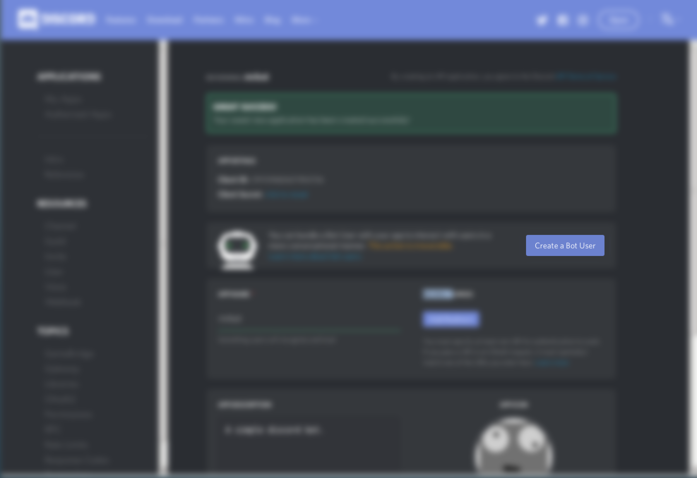
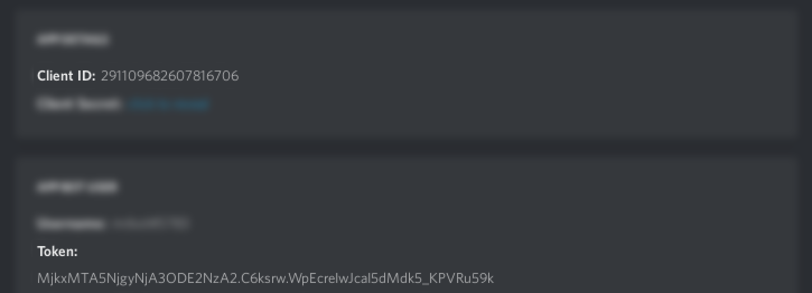
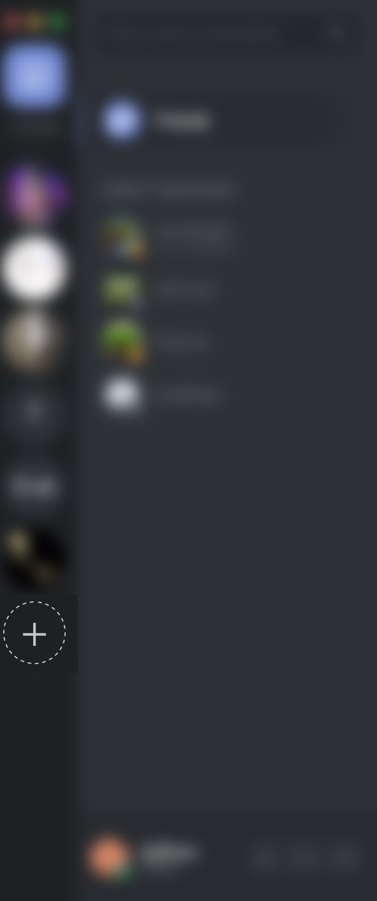
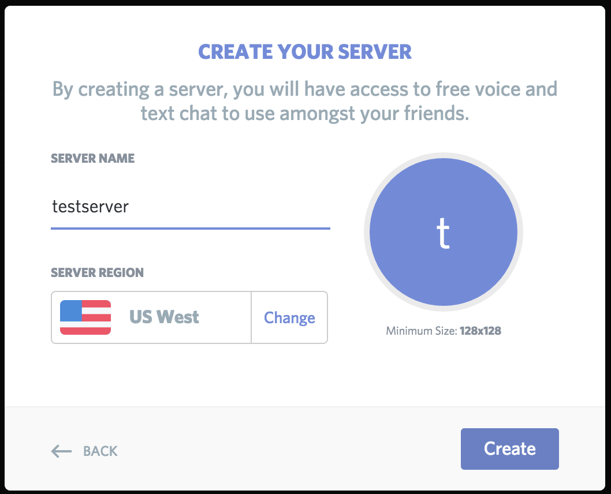
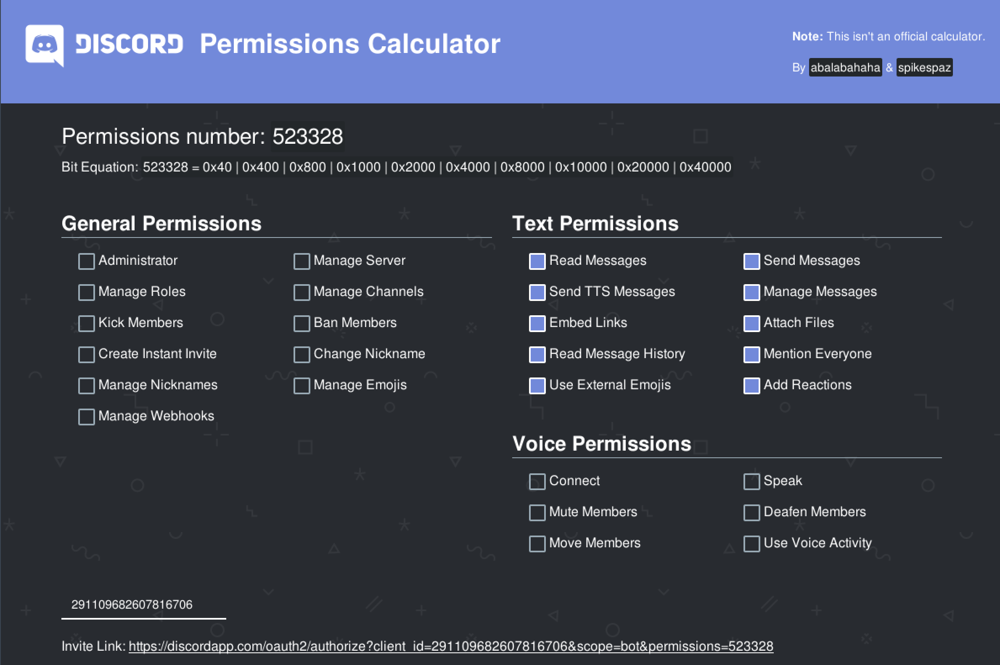
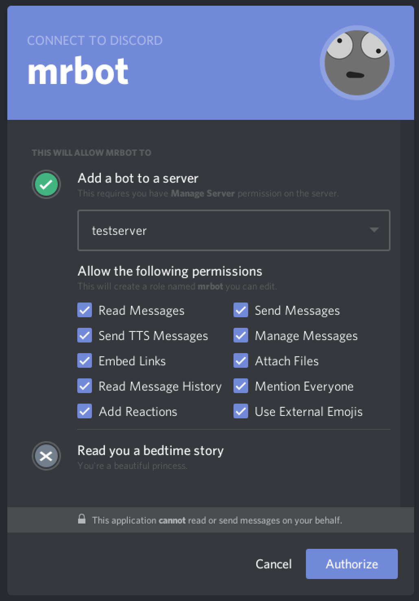

# Birth

How to create your bot and then connect it to a discord server.

---
Create an app on the discord website:
https://discordapp.com/developers/applications/me

Give your app a name and picture then turn it into a bot.

 

We are interested in two numbers: Cliend ID and Token.
Client ID will be used to add the bot to your server. Token will be used to login from our javascript program.

First create a test server.

 

Copy and paste the client ID into the lower left-hand box, specify permissions, then cick invite link at the bottom. Authorize the bot to connect to your test server.

https://discordapi.com/permissions.html

 

Your bot should now be connected to your discord server, congratulations.
