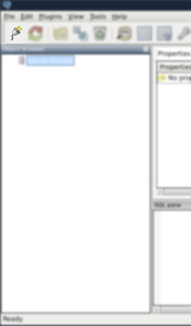
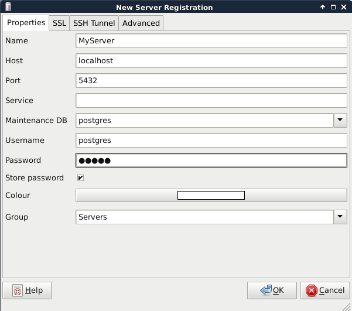
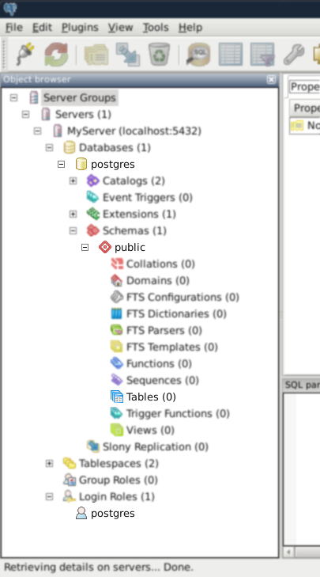
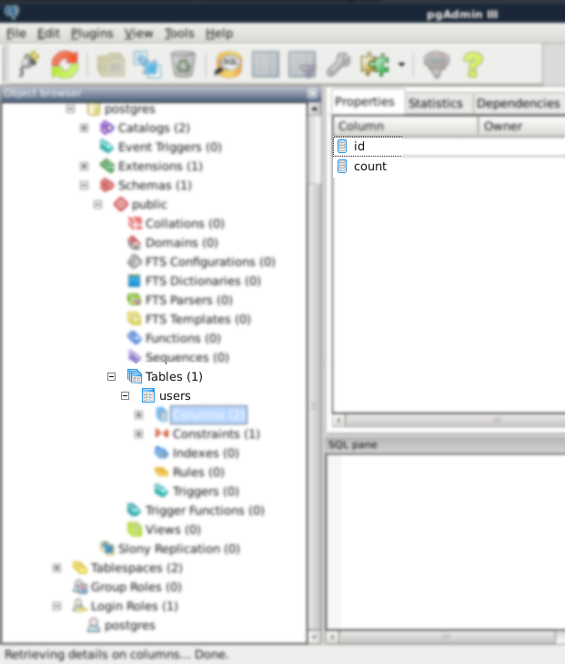
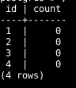
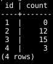

# What is a Postgres?

How to create and interact with a database via the command line.

---

PostgreSQL (postgres) is an open source database management system that is managed with SQL queries. A database is a collection of tables. Tables related to each other are put into schemas. We can use excel as an analogy.

A **folder**      is a collection of **spreadsheets** organized by **excel files**.
A **database** is a collection of **tables**       organized by **schemas**.


Optional: Installing postgres will create a new user on your linux named "postgres". The script below lists all users. Run this before and after installing to see for yourself.
```bash
cut -d : -f 1 /etc/passwd
```

Installing


```bash
sudo apt-get --purge remove postgresql* -y
sudo apt-get install postgresql postgresql-contrib -y
```
View the status, should be active
```bash
sudo service postgresql status
```

See other options:
```bash
sudo service postgresql
```

Connect to the database with the simple command:
```bash
psql
```
Just kidding, you should get an error. This is the purpose of the new user created. login to the postgres user:

```bash
sudo su postgres
#or
sudo -i -u postgres
```
And run the command again

```bash
psql
```
You are now connected to the database. From here on out the command line will accept SQL queries. To clear things up there is a postgres user on linux and a postgres user in the database, they are related, but different. By default, postgres on the database does not have a password so we will give the user a password and then quit out.

```bash
alter user postgres with password 'admin';
\q
```
Optional: Before we start messing with the database I will install pgadmin3 which is a GUI for postgres. You can do many things with pgadmin, but I will simply use it as a visual guide and continue to use the command line. Open a new terminal and run:
```bash
sudo apt-get install pgadmin3
```
 

Port may be different refer to:
```bash
more /etc/postgresql/9.4//main/postgresql.conf
```

The default database is named postgres (same as role/user), the default schema is named public and there are currently no tables yet.To make things simpler we will use all the defaults.



psql again and create a table for users. A user will have an id and a count columns.

```SQL
create table users(
    id text primary key,
    count integer default 10);
```

Change reflected in pgadmin.




I actually meant default 0 so I will delete the table and create it again.
```SQL
drop table users;
```

```SQL
create table users(
    id text primary key,
    count integer default 0);
```
Insert single row
```SQL
insert into users(id) values('1');
```

Insert multiple rows
```SQL
insert into users(id) values('2'), ('3'), ('4');
select * from users;
```

Our database is coming along nicely




Actually I didn't want their count to default to zero. I will delete and reinsert them.

```SQL
delete from users
where id >= '2';
select * from users;
```

```SQL
insert into users(id, count) values('2', 12), ('3', 15), ('4', 2);
select * from users;
```

Oops, user 4's count is one short, let me increase it by 1.

```SQL
update users set count = count + 1 where id = '4';
select * from users;
```



You should now know enough SQL for this project.
